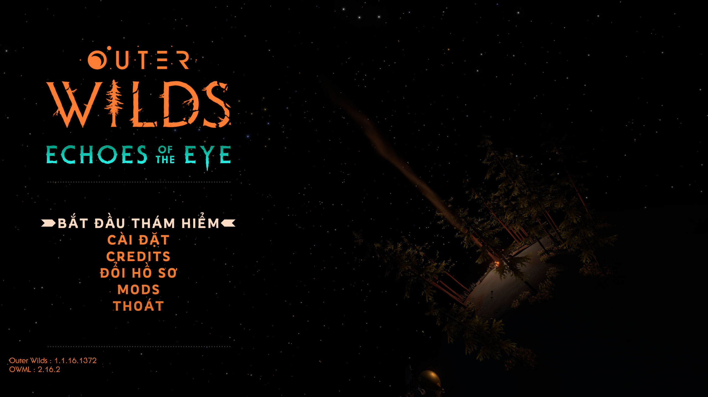
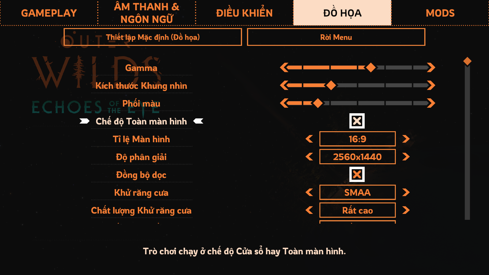

# Outer Wilds Việt Hóa

Bản mod Việt Hóa dành cho **Outer Wilds**.
- Dịch 100% bằng máy chạy cơm và nước St*ng dâu
- Bao gồm cả DLC **Echoes of the Eye**

## Gameplay Trailer
[**Xem trên Youtube**](https://youtu.be/dMwvYhIGTQ8?si=EDO42emAa6I1FYCh)

## Cài đặt

1. Cài đặt **Outer Wilds**.
2. Cài đặt và chạy [**Outer Wilds Mod Manager (OWML)**](https://outerwildsmods.com/mod-manager/).
3. Trong **OWML → Get Mods**, tìm và cài đặt **Outer Wilds Vietnamese**.
4. Kích hoạt bản mod Việt Hóa và bấm **Run Game**.
5. Chuyển ngôn ngữ thành Tiếng Việt trong Cài đặt (Options → Audio & Language → Language → Tiếng Việt)

## Phát hiện lỗi / Đóng góp bản dịch

Nếu phát hiện lỗi hoặc muốn đóng góp bản dịch, vui lòng liên hệ qua email:

**laluminescence.work@gmail.com**

Mình sẽ sắp xếp thời gian để xem xét và cải thiện bản dịch.

## Fonts được sử dụng

| Thành phần | Font |
|------------|------|
| Hội thoại | [Signika Negative](https://fonts.google.com/specimen/Signika+Negative) |
| Màn hình điều khiển phi thuyền | [Chakra Petch](https://fonts.google.com/specimen/Chakra+Petch) |
| Menu & Biển báo | [Rowdies](https://fonts.google.com/specimen/Rowdies) |
| Hướng dẫn điều khiển | [Dosis](https://fonts.google.com/specimen/Dosis) |

## Cảm ơn

Trân trọng cảm ơn [**xen42**](https://github.com/xen-42) và **Cộng đồng Outer Wilds Modding** đã xây dựng nền tảng để thực hiện bản dịch này.

## Screenshots

